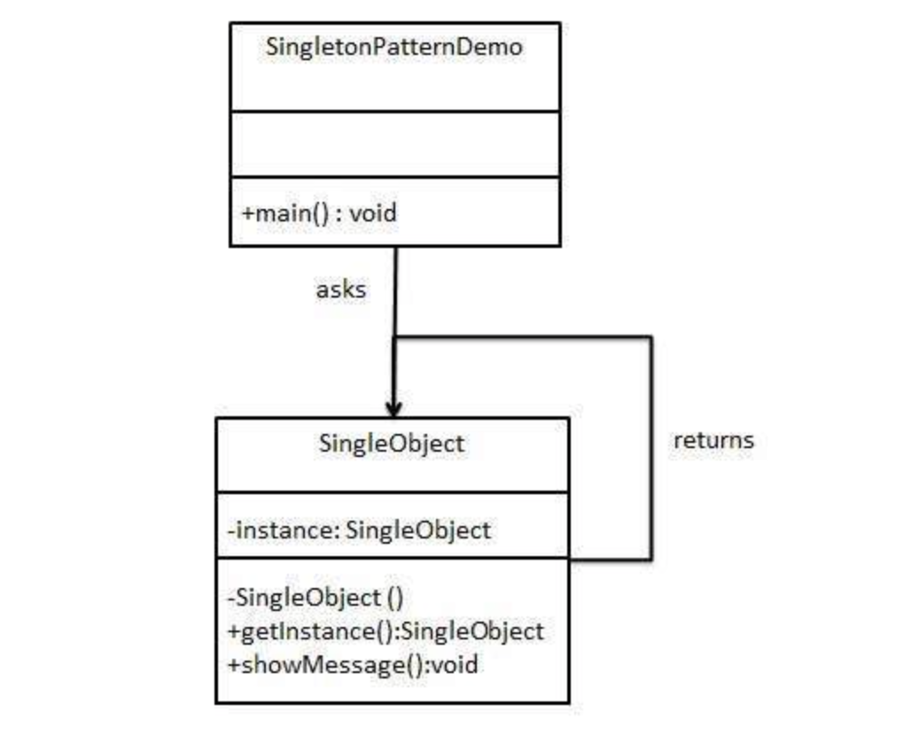

# DesignPattern Project

This project contains examples of various design patterns in Java.

## Instructions

### Prerequisites
Make sure you have Docker installed on your machine.

### Build Docker Image
Run the following command to build the Docker image:
```bash
docker build -t design-pattern-image .
```
### Run the following command
```bash
docker run -it --rm -v "$(pwd)":/app design-pattern-image
```
### Compile and Run Java Files
```bash
cd FactoryPattern
javac Main.java
java Main
```

# Patterns

### Creational
1. Factory
2. Abstract Factory
3. Singleton
4. Builder

### Structural
1. Adapter
2. Bridge 
3. Decorator
4. Facade
5. Proxy

### Behavioral
1. Observer


## Singleton Pattern

Singleton pattern is one of the simplest design patterns in Java. This type of design pattern comes under creational pattern as this pattern provides one of the best ways to create an object.
This pattern involves a single class which is responsible to create an object while making sure that only single object gets created. This class provides a way to access its only object which can be accessed directly without need to instantiate the object of the class.

### Pros
1. Controlled access to sole instance
2. Reduced namespace
3. Permits refinement of operations and representation
4. Permits a variable number of instances
5. Global Access Point: Provides a single, globally accessible instance of a class, simplifying access to shared resources or services throughout the application. This can be convenient for configuration settings, logging utilities, or resource management.
6. Improved Efficiency: Can potentially improve efficiency in some cases by avoiding the overhead of creating multiple instances of the same object. This is especially relevant for resource-intensive objects.
7. Enforced Single Instance: Ensures only one instance of a class exists, which can be beneficial in scenarios where maintaining a single state or configuration is crucial.
### Cons
1. Because Singletons introduce global state, unit testing can become challenging. Testing one component in isolation may be more complicated if it relies on a Singleton,
2. Overusing the Singleton pattern can lead to poorly designed and unmaintainable code. 
3. The Singleton pattern can make code less extensible.
